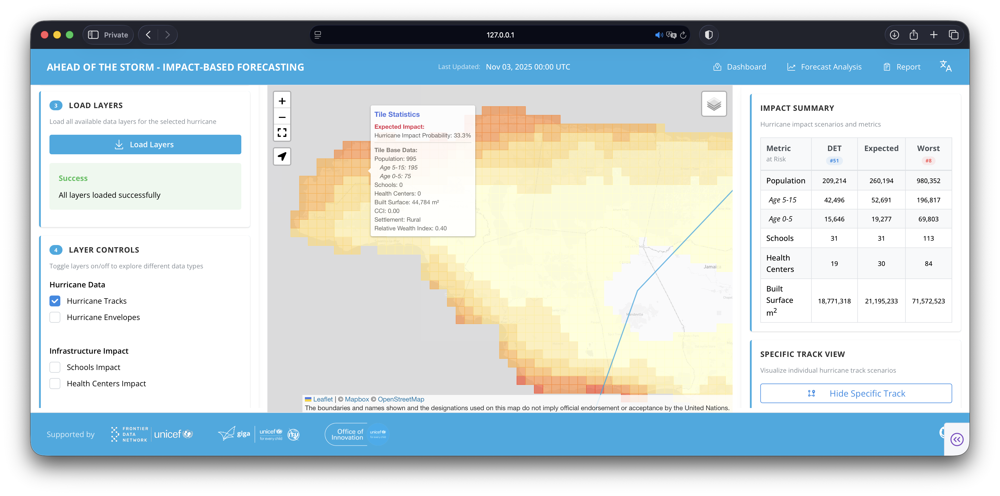

# Ahead of the Storm – Application Setup Guide

This repository contains the **Dash web application** for visualizing hurricane impact forecasts. The application displays interactive maps, probabilistic analysis, and impact reports based on pre-processed hurricane data.

## Related Repositories

- **[Ahead-of-the-Storm-DATAPIPELINE](https://github.com/unicef-drp/Ahead-of-the-Storm-DATAPIPELINE)**: Data processing pipeline for creating bounding boxes, initializing base data, and processing storm impact files that are read by the application
- **[TC-ECMWF-Forecast-Pipeline](https://github.com/unicef-drp/TC-ECMWF-Forecast-Pipeline)**: Pipeline for processing ECMWF BUFR tropical cyclone and wind forecast data

## Prerequisites

1. **Python 3.11+** installed
2. **Virtual environment** activated (`.venv`)
3. **Environment variables** configured in `.env` file
   - Start from the provided example: `cp sample_env .env`
   - Edit values to match your environment (Snowflake, optional Azure)
4. **Pre-processed data** available (see [Data Requirements](#data-requirements) below)

### Environment Setup

```bash
python3 -m venv .venv
source .venv/bin/activate  # On Windows: .venv\Scripts\activate
pip install --upgrade pip
pip install -r requirements.txt
```

### Required Environment Variables

#### Snowflake Configuration
- `SNOWFLAKE_ACCOUNT`, `SNOWFLAKE_USER`, `SNOWFLAKE_PASSWORD`
- `SNOWFLAKE_WAREHOUSE`, `SNOWFLAKE_DATABASE`, `SNOWFLAKE_SCHEMA`

#### Data Storage Configuration
- `RESULTS_DIR` (default: `project_results/climate/lacro_project`)
- `BBOX_FILE` (e.g., `bbox.parquet`)
- `STORMS_FILE` (e.g., `storms.json`)
- `ROOT_DATA_DIR` (e.g., `geodb`)
- `VIEWS_DIR` (e.g., `aos_views`)

#### Optional: Azure Blob Storage
- `DATA_PIPELINE_DB` (`LOCAL` by default; use `BLOB` or `RO_BLOB` for Azure)
- If using Azure: `ACCOUNT_URL`, `SAS_TOKEN`

#### Mapbox (for map visualization)
- `MAPBOX_ACCESS_TOKEN` (optional)

## Data Requirements

Before running the application, you need to have pre-processed data available. This includes:

1. **Bounding box** file: `project_results/climate/lacro_project/bbox.parquet`
2. **Base views**: Mercator tiles with demographic and infrastructure data in `geodb/aos_views/mercator_views/`
3. **Impact views**: Processed storm impact data in:
   - `geodb/aos_views/hc_views/` (health centers)
   - `geodb/aos_views/school_views/` (schools)
   - `geodb/aos_views/track_views/` (hurricane tracks)
   - `geodb/aos_views/mercator_views/` (tile impact data)

### Setting Up Data Processing

To generate the required data, follow the setup guide in the **[Ahead-of-the-Storm-DATAPIPELINE](https://github.com/unicef-drp/Ahead-of-the-Storm-DATAPIPELINE)** repository:

1. **Create bounding box** (one-time setup)
2. **Initialize base data** (demographic and infrastructure data - one-time setup)
3. **Process storm data** (run regularly to update with new storm data from Snowflake)

The hurricane forecast data is processed by the **[TC-ECMWF-Forecast-Pipeline](https://github.com/unicef-drp/TC-ECMWF-Forecast-Pipeline)** and can be loaded into Snowflake.

## Running the Application

### Development Mode

```bash
python app.py
```

The application will start on `http://127.0.0.1:8050` (or the port specified in your environment).

### Production Deployment

For production (e.g., Azure App Service), use the provided `startup.sh` script with Gunicorn:

```bash
./startup.sh
```

Or manually:

```bash
gunicorn --bind 0.0.0.0:8000 --workers 4 --timeout 120 app:server
```

## Application Features

The application provides three main views:

1. **Dashboard** (`/`): Interactive map showing:
   - Hurricane tracks (ensemble members and deterministic track)
   - Impact envelopes at different wind thresholds
   - Schools and health centers at risk
   - Population impact tiles
   - Impact metrics (deterministic, probabilistic, worst-case scenarios)



2. **Forecast Analysis** (`/analysis`): Statistical analysis including:
   - Box plots showing impact distribution across ensemble members
   - Exceedance probability curves
   - Impact summaries for population, children, infants, schools, health centers, and built surface
   - Percentile analysis

3. **Impact Report** (`/report`): HTML-based impact report with detailed administrative-level breakdowns

## Troubleshooting

### "Bounding box not found" error
- Ensure the bounding box file exists at the path specified by `RESULTS_DIR`/`BBOX_FILE`
- Run the bounding box creation step from the [DATAPIPELINE repository](https://github.com/unicef-drp/Ahead-of-the-Storm-DATAPIPELINE)

### "No data available" or missing views
- Verify that impact views exist in `geodb/aos_views/`
- Run the storm processing pipeline from the [DATAPIPELINE repository](https://github.com/unicef-drp/Ahead-of-the-Storm-DATAPIPELINE)
- Check that Snowflake contains the expected storm data

### "Snowflake connection error"
- Verify all `SNOWFLAKE_*` environment variables are set correctly
- Check network connectivity to Snowflake
- Ensure Snowflake credentials have proper permissions

### "Map not loading" or missing map tiles
- Verify `MAPBOX_ACCESS_TOKEN` is set (optional but recommended)
- Check browser console for JavaScript errors

### Application fails to start
- Verify all dependencies are installed: `pip install -r requirements.txt`
- Check that Python version is 3.11 or higher
- Review error logs for specific package or import errors

## Data Storage Locations

The application expects data in the following structure:

- **Bounding box:** `{RESULTS_DIR}/{BBOX_FILE}` (typically `project_results/climate/lacro_project/bbox.parquet`)
- **Base views:** `{ROOT_DATA_DIR}/{VIEWS_DIR}/mercator_views/` (e.g., `geodb/aos_views/mercator_views/`)
- **Impact views:** 
  - `{ROOT_DATA_DIR}/{VIEWS_DIR}/hc_views/` (health centers)
  - `{ROOT_DATA_DIR}/{VIEWS_DIR}/school_views/` (schools)
  - `{ROOT_DATA_DIR}/{VIEWS_DIR}/track_views/` (hurricane tracks)
- **Processed storms metadata:** `{RESULTS_DIR}/{STORMS_FILE}` (typically `project_results/climate/lacro_project/storms.json`)

## Architecture

- **Frontend**: Dash with Mantine Components, Dash Leaflet for maps, Plotly for charts
- **Backend**: Python with GeoPandas for geospatial processing
- **Data Sources**: 
  - Snowflake (hurricane track and envelope data)
  - Pre-processed impact views using [giga-spatial](https://github.com/unicef/giga-spatial)(local filesystem or Azure Blob Storage)
- **Deployment**: Gunicorn for production (Azure App Service compatible)
