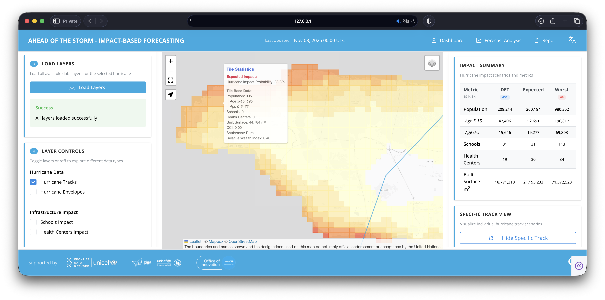

# Ahead of the Storm – Application Setup Guide

This repository contains the **Dash web application** for visualizing hurricane impact forecasts. The application displays interactive maps, probabilistic analysis, and impact reports based on pre-processed hurricane data.

## Related Repositories

- **[Ahead-of-the-Storm-DATAPIPELINE](https://github.com/unicef-drp/Ahead-of-the-Storm-DATAPIPELINE)**: Data processing pipeline for initializing base data and processing storm impact files that are read by the application
- **[TC-ECMWF-Forecast-Pipeline](https://github.com/unicef-drp/TC-ECMWF-Forecast-Pipeline)**: Pipeline for processing ECMWF BUFR tropical cyclone and wind forecast data

## Prerequisites

1. **Python 3.11+** installed
2. **Virtual environment** activated (`.venv`)
3. **Environment variables** configured in `.env` file
   - Start from the provided example: `cp sample_env .env`
   - Edit values to match your environment (Snowflake, optional Azure)
4. **Pre-processed data** available (see [Data Requirements](#data-requirements) below)

### Environment Setup

```bash
python3 -m venv .venv
source .venv/bin/activate  # On Windows: .venv\Scripts\activate
pip install --upgrade pip
pip install -r requirements.txt
```

### Required Environment Variables

#### Snowflake Configuration
- `SNOWFLAKE_ACCOUNT`, `SNOWFLAKE_USER`, `SNOWFLAKE_PASSWORD`
- `SNOWFLAKE_WAREHOUSE`, `SNOWFLAKE_DATABASE`, `SNOWFLAKE_SCHEMA`

#### Data Storage Configuration
- `RESULTS_DIR` (default: `results`) — stores report templates and generated JSON reports
- `ROOT_DATA_DIR` (default: `geodb`)
- `VIEWS_DIR` (default: `aos_views`)
- `REPORT_TEMPLATE_FILE` (default: `impact-report-template.html`)

#### Optional: Impact Data Source and Storage

Two independent variables control how the app loads impact data:

**`IMPACT_DATA_SOURCE`** — controls *which* data source is used for impact views:
- `STAGE` (default): downloads CSV/Parquet files from the file store (see `IMPACT_DATA_STORE` below)
- `SQL`: queries Snowflake materialized tables (`*_MAT`) directly via SQL — faster, no file downloads, works regardless of `IMPACT_DATA_STORE` as long as Snowflake credentials are present

  When `IMPACT_DATA_SOURCE=SQL` the app queries:
  - `MERCATOR_TILE_IMPACT_MAT` — tile-level probabilistic impact
  - `ADMIN_ALL_IMPACT_MAT` — admin-region impact with probability
  - `MERCATOR_TILE_CCI_MAT` / `ADMIN_ALL_CCI_MAT` — Child Climate Index overlays
  - `SCHOOL_IMPACT_MAT` / `HC_IMPACT_MAT` — point data for schools and health centres
  - `TRACK_MAT` — per-ensemble-member severity and envelope geometry

  These tables must be set up first — see `snowflake/mat_tables/README.md`.

**`IMPACT_DATA_STORE`** — controls *where* stage files are stored (only relevant when `IMPACT_DATA_SOURCE=STAGE`):
- `LOCAL` (default): local filesystem
  - **For SPCS deployment**: uses mounted volume at `/datastore`
  - **For local development**: uses local filesystem
- `BLOB`: Azure Blob Storage (read-only)
- `SNOWFLAKE`: Snowflake internal stage (read-only)

Note: Snowflake is used for BOTH raw hurricane forecast data (TC_TRACKS / TC_ENVELOPES_COMBINED tables) AND impact data. `IMPACT_DATA_SOURCE=SQL` uses the Snowflake connection that is already required for forecast data.

- If using Azure Blob Storage: `ADLS_ACCOUNT_URL`, `ADLS_SAS_TOKEN`, `ADLS_CONTAINER_NAME`
- If using Snowflake stage: `SNOWFLAKE_STAGE_NAME` (name of the Snowflake internal stage)

#### SPCS Authentication (Snowflake Container Services deployment only)
- `SPCS_RUN` — set to `true` to enable OAuth token auth via `/snowflake/session/token` (default: `false`)
- `SPCS_TOKEN_PATH` (default: `/snowflake/session/token`)
- `SNOWFLAKE_HOST`, `SNOWFLAKE_PORT` — required when `SPCS_RUN=true`

#### Mapbox (for map visualization)
- `MAPBOX_ACCESS_TOKEN` (optional — falls back to OpenStreetMap tiles)

## Data Requirements

**When `IMPACT_DATA_SOURCE=SQL`** (recommended): no local data files are needed. The app queries Snowflake MAT tables directly.

**When `IMPACT_DATA_SOURCE=STAGE`**: pre-processed impact views must be available in the configured `IMPACT_DATA_STORE`. For `IMPACT_DATA_STORE=LOCAL`, the following directories are expected:

- `{ROOT_DATA_DIR}/{VIEWS_DIR}/mercator_views/` — base Mercator tiles (demographic/infrastructure)
- `{ROOT_DATA_DIR}/{VIEWS_DIR}/school_views/` — school impact data
- `{ROOT_DATA_DIR}/{VIEWS_DIR}/hc_views/` — health centre impact data
- `{ROOT_DATA_DIR}/{VIEWS_DIR}/shelter_views/` — shelter impact data
- `{ROOT_DATA_DIR}/{VIEWS_DIR}/wash_views/` — WASH facility impact data
- `{ROOT_DATA_DIR}/{VIEWS_DIR}/track_views/` — hurricane track data

### Setting Up Data Processing

To generate the required data, follow the setup guide in the **[Ahead-of-the-Storm-DATAPIPELINE](https://github.com/unicef-drp/Ahead-of-the-Storm-DATAPIPELINE)** repository:

1. **Initialize base data** (demographic and infrastructure data — one-time setup)
2. **Process storm data** (run regularly to update with new storm data from Snowflake)

The hurricane forecast data is processed by the **[TC-ECMWF-Forecast-Pipeline](https://github.com/unicef-drp/TC-ECMWF-Forecast-Pipeline)** and loaded into Snowflake.

## Running the Application

### Development Mode

The Dash app and tile server must both be running. Start them in two separate terminals:

```bash
# Terminal 1 — Dash app (http://127.0.0.1:8050)
python app.py

# Terminal 2 — FastAPI tile server (http://127.0.0.1:8001)
uvicorn services.tile_server:app --host 127.0.0.1 --port 8001 --reload
```

### Production Deployment (SPCS)

Production runs as a Docker container on **Snowflake Container Services (SPCS)**. `entrypoint.sh` orchestrates three processes inside the container:

```
nginx  0.0.0.0:8000   (public — reverse proxy + tile cache)
  ├─► gunicorn Dash   127.0.0.1:8050  (1 worker × 8 threads)
  └─► uvicorn tiles   127.0.0.1:8001  (FastAPI tile server)
```

```bash
# Build
docker build -t unicef-dash-app:latest . --platform=linux/amd64
```

A single gunicorn worker (1 process × 8 threads) is required to avoid fork-safety issues with `snowflake-connector-python` and Dash callback-map race conditions. Do not increase `--workers` beyond 1.

## Application Features

The application provides three main views:

1. **Dashboard** (`/`): Interactive map showing:
   - Hurricane tracks (ensemble members and deterministic track)
   - Impact envelopes at different wind thresholds
   - Schools, health centers, shelters, and WASH facilities at risk
   - Population impact tiles
   - Impact metrics (deterministic, probabilistic, worst-case scenarios)



2. **Forecast Analysis** (`/analysis`): Statistical analysis including:
   - Box plots showing impact distribution across ensemble members
   - Exceedance probability curves
   - Impact summaries for population, children, infants, schools, health centers, and built surface
   - Percentile analysis

3. **Impact Report** (`/report`): HTML-based impact report with detailed administrative-level breakdowns

## Troubleshooting

### "No data available" or missing views
- If using `IMPACT_DATA_SOURCE=SQL`: verify Snowflake MAT tables are populated (see `snowflake/mat_tables/README.md`)
- If using `IMPACT_DATA_SOURCE=STAGE`: verify that impact views exist in `{ROOT_DATA_DIR}/{VIEWS_DIR}/`
- Run the storm processing pipeline from the [DATAPIPELINE repository](https://github.com/unicef-drp/Ahead-of-the-Storm-DATAPIPELINE)
- Check that Snowflake contains the expected storm data

### "Snowflake connection error"
- Verify all `SNOWFLAKE_*` environment variables are set correctly
- Check network connectivity to Snowflake
- Ensure Snowflake credentials have proper permissions

### "Map not loading" or missing map tiles
- Verify the tile server is running: `curl http://localhost:8001/health` should return `{"status":"ok"}`
- Verify `TILE_SERVER_URL` env var points to the tile server (default: `http://localhost:8001`)
- Verify `MAPBOX_ACCESS_TOKEN` is set (optional but recommended)
- Check browser console for JavaScript errors

### Application fails to start
- Verify all dependencies are installed: `pip install -r requirements.txt`
- Check that Python version is 3.11 or higher
- Review error logs for specific package or import errors

## Data Storage Locations

- **Report template:** `{RESULTS_DIR}/impact-report-template.html` (default: `results/impact-report-template.html`)
- **Generated reports:** `{RESULTS_DIR}/jsons/`
- **Base views:** `{ROOT_DATA_DIR}/{VIEWS_DIR}/mercator_views/` (e.g., `geodb/aos_views/mercator_views/`)
- **Impact views:**
  - `{ROOT_DATA_DIR}/{VIEWS_DIR}/school_views/` (schools)
  - `{ROOT_DATA_DIR}/{VIEWS_DIR}/hc_views/` (health centers)
  - `{ROOT_DATA_DIR}/{VIEWS_DIR}/shelter_views/` (shelters)
  - `{ROOT_DATA_DIR}/{VIEWS_DIR}/wash_views/` (WASH facilities)
  - `{ROOT_DATA_DIR}/{VIEWS_DIR}/track_views/` (hurricane tracks)

## Architecture

- **Frontend**: Dash with Mantine Components, MapLibre GL JS for tile rendering (Dash Leaflet as map container), Plotly for charts
- **Backend**: Python with GeoPandas for geospatial processing; FastAPI tile server sidecar (`services/tile_server.py`, port 8001) serves WebP raster tiles and MVT vector tiles
- **Data Sources**:
  - Snowflake — hurricane track/envelope data (`TC_TRACKS`, `TC_ENVELOPES_COMBINED`) and, when `IMPACT_DATA_SOURCE=SQL`, impact data via materialized tables (`*_MAT`)
  - Pre-processed impact views via [giga-spatial](https://github.com/unicef/giga-spatial) — used when `IMPACT_DATA_SOURCE=STAGE` (local filesystem, Azure Blob, or Snowflake stage)
- **AI Agent**: `HURRICANE_INTELLIGENCE` Snowflake Cortex agent — generates situation reports from the same MAT tables (see `snowflake/intelligence/`)
- **Deployment**: Docker container on Snowflake Container Services (SPCS) — nginx reverse proxy + gunicorn Dash app + uvicorn tile server (see `entrypoint.sh` and `Dockerfile`)
